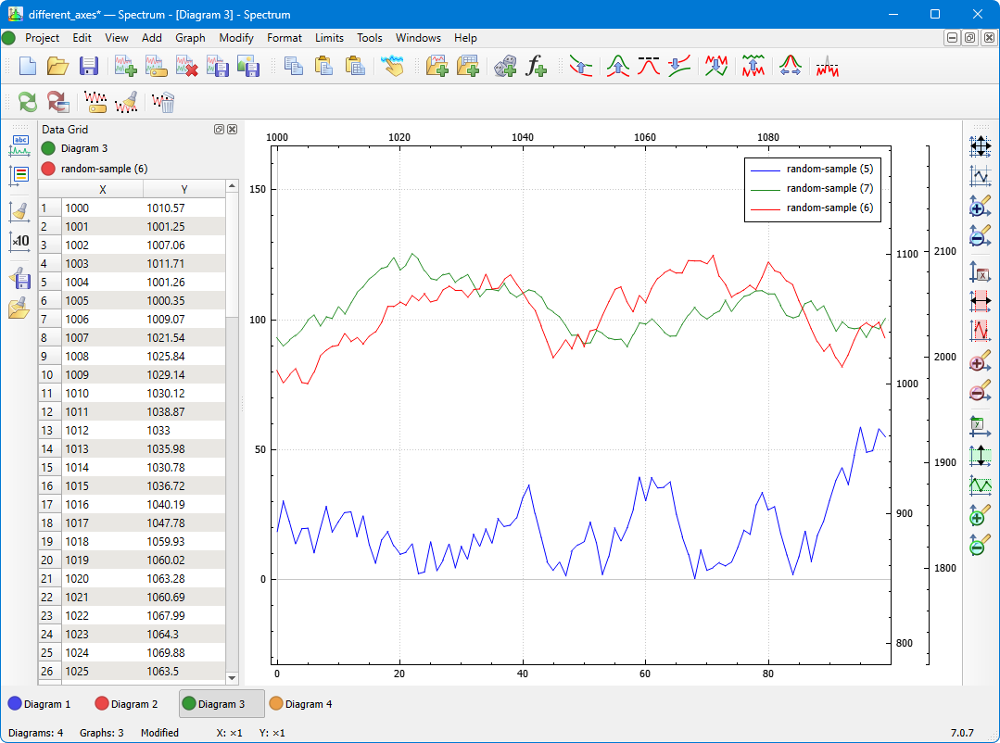

# Spectrum

[Spectrum](http://www.spectrum.orion-project.org/) is an application for plotting, processing, transformation, and analyzing of numerical and experimental data.

This is the official port of Spectrum to [Qt](qt.io) framework. The goal is to make it open-source and cross-platform.

## Features

```
Load                             Apply                                     Plot
experiment data                  modifiers (optionally)                    the result

[ Data source ] -----> [ Modifier 1 ] --> [ ... ]--> [ Modifier N ] -----> [Final graph]
|                      |                                                   |
* Text file            * Scale                                             * Line format
* Csv file             * Translate                                         * Assigned axes
* Clipboard            * Differentiate                                     * Data table
* User Formula         * User Formula (TBD)                                * Copy/paste
* ...                  * ...
       ↑                                                                         |
       |                       Reload updated experiment data                    |
       |                        and re-apply all processing                      |
       +------------------------------------------------------------------------ +
```

TODO: find a proper wording for feature list
- different data-sources - files, user formula (lua)
- several graphs from single file (csv columns)
- multiple diagram pages (mdi windows)
- multiple configurable modifiers
- can reload graph from data source and reapply transformations
- multiple axis for comparison graphs of different scales
- can set different scale factors for axes (*1000, etc)
- data table to show point values
- can format all plot parts - axes, title, etc
- can export/import, copy/paste plot formats
- can store all data and formats in project files
- ... bring more features from v5

## Download

See [releases](https://github.com/orion-project/spectrum/releases) to download a prebuilt binary package (for now only for Window). See [build instructions](./docs/build.md) for building from source code. Old stable versions can be downloaded from project's [Home page](http://www.spectrum.orion-project.org/index.php?page=dload).


