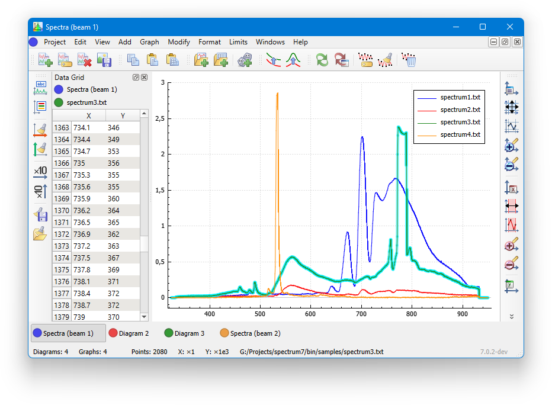

# Spectrum

[Spectrum](http://www.spectrum.orion-project.org/) is an application for plotting, processing, transformation, and analyzing of numerical and experimental data.

This is the official port of Spectrum to [Qt](qt.io) framework. The goal is to make it open-source and cross-platform.

Currently, it is in development state, no binary releases available yet. See [build instructions](./docs/build.md) for building from source code. Old stable versions can be downloaded from project's [Home page](http://www.spectrum.orion-project.org/index.php?page=dload).

