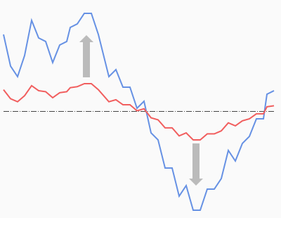
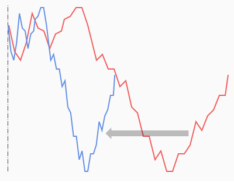

# Scale

```
► Modify ► Scale
```

Scale graph by some factor around specified center in vertical or horizontal direction.

## Examples

Scale over axis Y around average value with factor > 1:



Scale over axis X against minimum with factor < 1:


