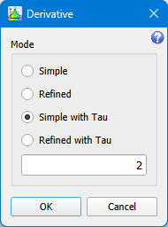

# First Derivative

```
► Modify ► First Derivative...
```

The function calculates the first derivative of the selected graph.

## Parameters



Mode defines a formula used for computing of Y values of the result graph.

### Simple

<p class="formula">
dY<sub>i</sub> = (Y<sub>i</sub> − Y<sub>i−1</sub>) / (X<sub>i</sub> − X<sub>i−1</sub>)
</p>

The result graph has one point less than the original one.

### Refined

Each point is calculated by averaging of the left and right intervals.

<p class="formula">
dY<sub>left,i</sub> = (Y<sub>i</sub> − Y<sub>i−1</sub>) / (X<sub>i</sub> − X<sub>i−1</sub>)
</p>

<p class="formula">
dY<sub>right,i</sub> = (Y<sub>i+1</sub> − Y<sub>i</sub>) / (X<sub>i+1</sub> − X<sub>i</sub>)
</p>

<p class="formula">
dY<sub>i</sub> = (dY<sub>left,i</sub> + dY<sub>right,i</sub>) / 2
</p>

The result graph has the same number of points than the original one. The first and the last points are calculated using the Simple algorithm.

### Simple with Tau

A given fixed value used for <span class="formula">dX</span>.

<p class="formula">
dY<sub>i</sub> = (Y<sub>i</sub> − Y<sub>i−1</sub>) / τ
</p>

The result graph has one point less than the original one.

### Refined with Tau

Each point is calculated by averaging of the left and right intervals. A given fixed value used for <span class="formula">dX</span>.

<p class="formula">
dY<sub>left,i</sub> = (Y<sub>i</sub> − Y<sub>i−1</sub>) / τ
</p>

<p class="formula">
dY<sub>right,i</sub> = (Y<sub>i+1</sub> − Y<sub>i</sub>) / τ
</p>

<p class="formula">
dY<sub>i</sub> = (dY<sub>left,i</sub> + dY<sub>right,i</sub>) / 2
</p>

The result graph has the same number of points than the original one. The first and the last points are calculated using the Simple with Tau algorithm.
