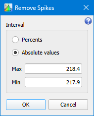

# Remove Spikes

```
► Modify ► Remove Spikes...
```
The function deletes random spikes or pulses from the graph. Spikes are separate points falling off the data series described by the formula: 

<span style="font-family:Times New Roman;font-size:14pt"><i>Y<sub>i</sub> = Y<sub>avg</sub> ± ΔY </i></span>

The points whose values differ from the average value Y<sub>avg</sub> on more than acceptable deviation ΔY are reduced to the average value Y<sub>avg</sub>. 

The function can be useful for frequency stability analysis, in particular, when you have to eliminate random frequency pulses that are not intrinsic to the investigated system. Those pulses usually appear as a result of external noises and should not be taken into account. For example, see the file `sample/spikes.txt`.

⚠️ In the current version, the function correctly processes only graphs having all their Y values near some average value. Data having some trend (falling or rising, for example) will be processed incorrectly. 

## Parameters



### By Percent 

If the option is set, you have to define the deviation in percent of the average value. 

### Absolute Values 

You can set the acceptable interval as absolute maximal and minimal values. All graph points whose Y values fall off this interval will be reduced to the average value. The interval should contain the average value; otherwise, the graph will not be processed.
