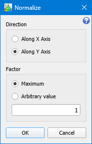

# Normalize

```
► Modify ► Normalize
```

The function normalizes the graph along given axis processing points by the formula: 

<span style="font-family:Times New Roman;font-size:14pt"><i>V<sub>i</sub> = V<sub>i</sub> / factor</i></span>

Where *V* is the *X* or *Y* values of the graph, depending on the chosen normalization direction.

## Parameters



### Direction

Axis to normalize along. The option defines a graph value array to be processed: *X* or *Y*.

### Maximum 

If the option is set, then the maximal value of *X* or *Y* depending on the chosen normalization axis is used as a normalization factor.

### Value 

Arbitrary normalization factor.
