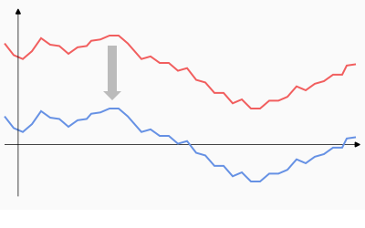
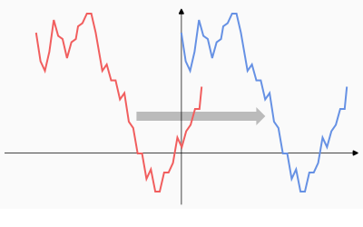

# Offset

```
► Modify ► Offset
```

Shift graph in horizontal or vertical direction by specified value or to specified position.

## Examples

Shift along axis Y so that average value goes to zero:



Shift along axis X so that minimum value goes to zero:

