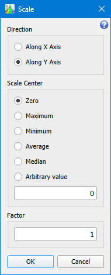
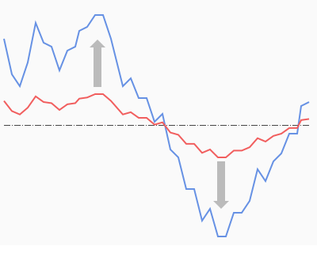
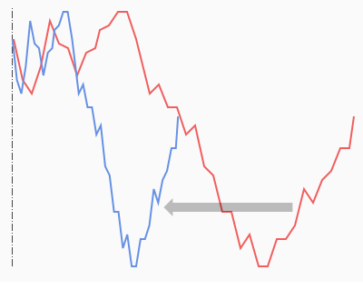

# Scale

```
► Modify ► Scale
```

The function normalizes the graph along given axis processing points by the formula: 

<span style="font-family:Times New Roman;font-size:14pt"><i>V<sub>i</sub> = (V<sub>i</sub> - center) × factor + center</i></span>

Where *V* is the *X* or *Y* values of the graph, depending on the chosen normalization direction, and the *center* value is chosen depending on the selected parameter.

## Parameters



### Direction

Axis to normalize along. The option defines a graph value array to be processed: *X* or *Y*.

### Center

The options group defines a scaling center. The scaling center can be imaged as a point that does not change its position after processing.

### Factor 

Scaling factor.

## Examples

Scale over axis Y around average value with factor > 1:



Scale over axis X against minimum with factor < 1:


